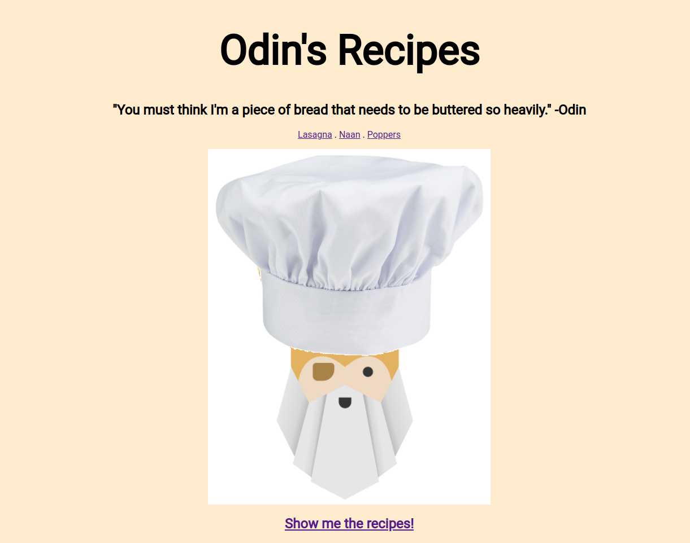

 # RECIPES
A project for TheOdinProject's HTML Foundations course. You'll find some summaries of recipes and pictures of some delicious foods.

**Link to project:** https://www.andyglover.io/odin-recipes/

## How It's Made:

**Tech used:** HTML, CSS

It's fun to look back on this project, this was me just getting back into HTML and CSS and having a great time with it, some real fun. Especially hopping into GIMP and putting the chef hat on Odin's head!

## Optimizations

I'd like to make the navigation more consistent on each page, perhaps using javascript to add the same list of links to the top of each page.

## Lessons Learned:

This was a big refresher for me, using github pages, basic CSS, GIMP, writing markdown, and committing to github repositories from the command line.

## Examples:
Here's a few more repositories of mine you might like to check out:

**Rock Paper Scissors:** https://github.com/andyglover/odin-rock-paper-scissors

**GIF Thingy:** https://github.com/andyglover/gif-thingy

**Calculator:** https://github.com/andyglover/odin-calculator